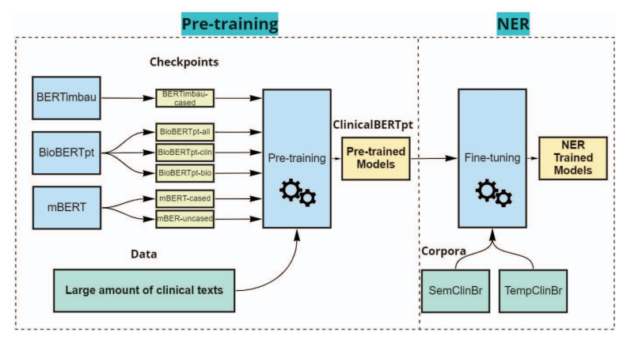
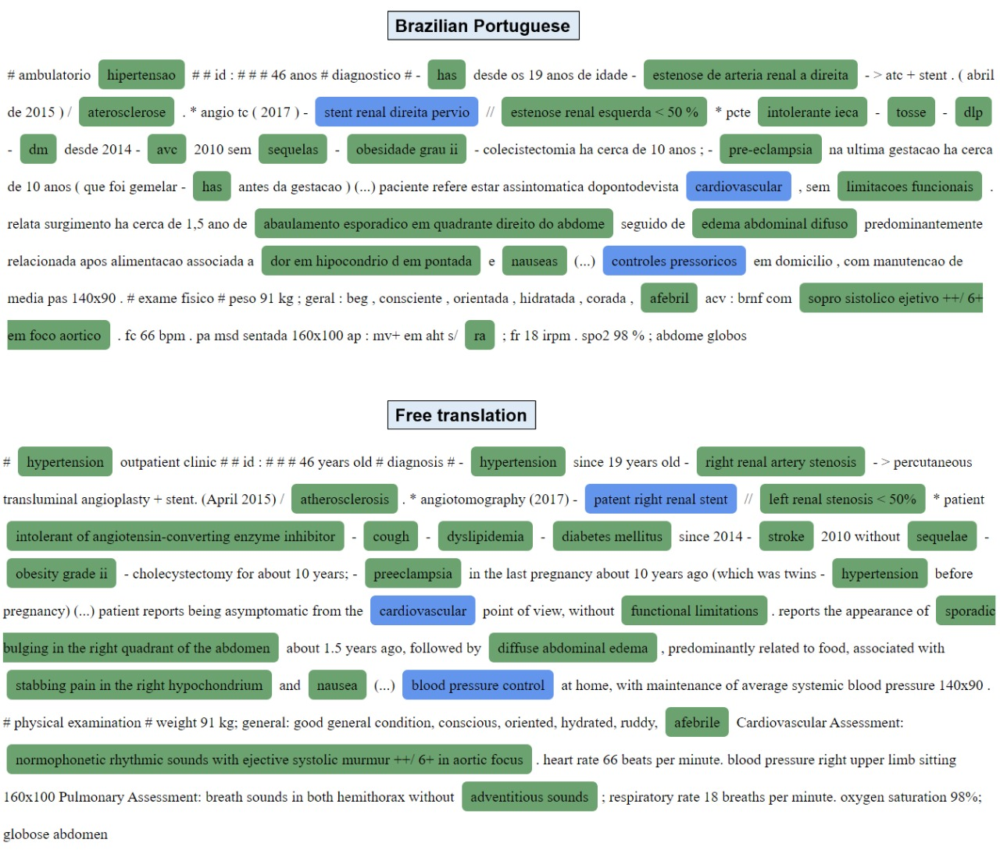

# CardioBERTpt - Portuguese Transformer-based Models for Clinical Language Representation in Cardiology

Contextual word embeddings and the Transformers architecture have reached state-of-the-art results in many natural language processing (NLP) tasks and improved the adaptation of models for multiple domains. Despite the improvement in the reuse and construction of models, few resources are still developed for the Portuguese language, especially in the health domain.

Furthermore, the clinical models available for the language are not representative enough for all medical specialties. This work explores deep contextual embedding models for the Portuguese language to support clinical NLP tasks. We transferred learned information from electronic health records of a Brazilian tertiary hospital specialized in cardiology diseases and pre-trained multiple clinical BERT-based models. We evaluated the performance of these models in named entity recognition experiments, fine-tuning them in two annotated corpora containing clinical narratives. Our pre-trained models outperformed previous multilingual and Portuguese BERT-based models for cardiology and multi-specialty environments, reaching the state-of-the-art for analyzed corpora, with 5.5% F1 score improvement in TempClinBr (all entities) and 1.7% in SemClinBr (Disorder entity) corpora. Hence, we demonstrate that data representativeness and a high volume of training data can improve the results for clinical tasks, aligned with results for other languages.

Paper: [https://ieeexplore.ieee.org/document/10178779](https://ieeexplore.ieee.org/document/10178779)

Repository: [https://huggingface.co/pucpr-br/cardiobertpt](https://huggingface.co/pucpr-br/cardiobertpt)

Training overview:



Example:



## Prerequisite

Please download the amazing [Huggingface implementation of BERT](https://github.com/huggingface/pytorch-pretrained-BERT).

For more information, you can refer to these [examples](https://github.com/huggingface/pytorch-pretrained-BERT/tree/master/examples).

## How to use the model

Load the model via the transformers library:
```
from transformers import AutoTokenizer, AutoModel
tokenizer = AutoTokenizer.from_pretrained("pucpr-br/cardiobertpt")
model = AutoModel.from_pretrained("pucpr-br/cardiobertpt")
```

## Acknowledgements

This study was financed in part by the Coordenação de Aperfeiçoamento de Pessoal de Nível Superior - Brasil (CAPES) - Finance Code 001, and by Foxconn Brazil and Zerbini Foundation as part of the research project Machine Learning in Cardiovascular Medicine.

## Citation

```
@INPROCEEDINGS{10178779,
  author={Schneider, Elisa Terumi Rubel and Gumiel, Yohan Bonescki and de Souza, João Vitor Andrioli and Mie Mukai, Lilian and Emanuel Silva e Oliveira, Lucas and de Sa Rebelo, Marina and Antonio Gutierrez, Marco and Eduardo Krieger, Jose and Teodoro, Douglas and Moro, Claudia and Paraiso, Emerson Cabrera},
  booktitle={2023 IEEE 36th International Symposium on Computer-Based Medical Systems (CBMS)}, 
  title={CardioBERTpt: Transformer-based Models for Cardiology Language Representation in Portuguese}, 
  year={2023},
  volume={},
  number={},
  pages={378-381},
  doi={10.1109/CBMS58004.2023.00247}}

```

